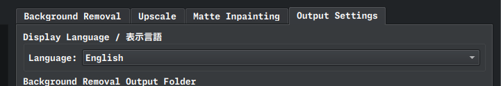
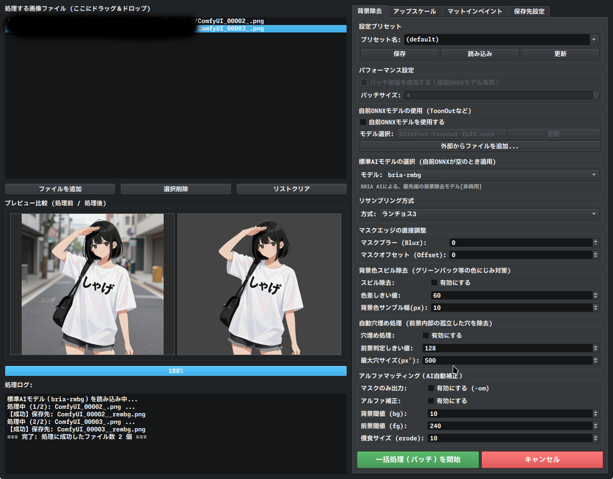

### 🌐 English Support Included

The interface is intuitive and easy to understand without a full manual. Complete English documentation (like this README) is not provided. Please use your preferred translation tool if you need further assistance.



# Rembg Toolkit

Rembg Toolkit は、AI技術（`rembg`）を活用した 多機能・一括背景除去 GUI ツールです。
最新の Python 3.14 環境に最適化されており、GPU（CUDA）による高速な推論処理に対応しています。

単なる背景切り抜きにとどまらず、境界調整機能やカスタムモデル対応を備えており、大量の画像を一括で美しく処理することができます。



---

## 主な機能 (Features)

* **📦 一括処理 (Batch Processing):** フォルダ内の大量の画像を、ワンクリックでまとめて背景除去します。
* **📐 マスクエッジの微調整 (Edge Adjustment):** 切り抜いた境界線の滑らかさやボケ具合を、直感的なGUIで調整可能です。
* **🎨 背景色スピル除去 (Color Spill Removal):** 元の背景の色が被写体のエッジに反射して残る「色被り（スピル）」を綺麗に除去します。
* **✂️ 高精度アルファマッティング (Alpha Matting):** 髪の毛や半透明の衣服など、AIだけでは難しい複雑な境界線を `pymatting` 技術で繊細に抽出します。
* **🤖 カスタムモデル対応 (Custom Models):** 標準のAIモデルだけでなく、ユーザーが自前で用意した学習済みモデル（`.onnx`等）を読み込んで処理に使用できます。
* **[update] アップスケール** 
* **[update] マットインペイント** 

### ⚠️ 動作確認に関する注意点 (Notice)
* **検証済み環境:** CachyOS (Arch Linux) + NVIDIA GPU (CUDA) 環境でのみ開発・動作確認を行っています。
* **CPU動作 / Windows環境について:** CPUのみでの動作や Windows 環境での検証は行っていません。各自適当に解決してください。 
* **Linuxでも動作とかしなかったら各自適当に解決してください。**バグとか導入方法よくわからないとかissuesに書いておいてもらってもいいです。

---

## 動作環境 / 依存関係 (Requirements)

本ツールをGPU（NVIDIA製グラフィックボード）で高速に動作させるためには、以下の環境が必要です。

### 1. システム要件 (System Dependencies)
お使いのOSに、以下のドライバーおよびライブラリがインストールされている必要があります。
* **NVIDIA Display Driver**
* **CUDA Toolkit** 
* **cuDNN** 

> **💡 CachyOS / Arch Linux ユーザーへのメモ:**
> 以下のコマンド等であらかじめインストールしておいてください。
> ```bash
> sudo pacman -S cuda cudnn
> ```

### ⚠️ バージョンに関する注意点とトラブルシューティング
`requirements.txt` でインストールされる `onnxruntime-gpu` のバージョン（1.27.0）と、お使いのシステム（CUDA / cuDNN）のバージョンが厳密に一致していないと、GPUを認識せずにCPU動作になってしまいます。

作者の手元（CachyOS環境）では **CUDA 13.3.0 / cuDNN 9.21.0** の組み合わせで正常にGPU動作することを確認しています。

もし上記コマンド等でインストールしてもGPU動作がしない場合は、以下のコマンドで自身の環境のバージョンを確認し、各自適当に調べて解決してください。
```bash
sudo pacman -Qi cuda cudnn
```

---

## インストール方法 (Installation)

本ツールは Python 3.14 環境で開発しています。
他のバージョンで動かなかったら3.14で試してみてください。
環境を汚さずスムーズに導入するため、`uv` とか `pyenv` とかを使用したバージョン管理・仮想環境の構築を強く推奨します。

### 🛠️ 1. 仮想環境の構築 (Recommended)

わかってる方は適当に読み飛ばして下さい。  

#### uv を使用する場合 (最速・推奨)
```bash
# プロジェクトフォルダへ移動
cd rembg-gui

# Python 3.14 の仮想環境を作成して有効化
uv venv --python 3.14
source .venv/bin/activate
```

#### pyenv を使用する場合
```bash
# Python 3.14 をインストールしてローカルに設定
pyenv install 3.14:latest
pyenv local 3.14.x  # インストールしたバージョンを指定

# 仮想環境（venv）の作成と有効化
python -m venv .venv
source .venv/bin/activate
```

### 📦 2. 依存パッケージのインストール (Dependencies)

仮想環境が有効（`(.venv)` がプロンプトに表示されている状態）であることを確認し、以下を実行します。

```bash
# uv をお使いの場合
uv pip install -r requirements.txt

# 通常の pip をお使いの場合
pip install -r requirements.txt
```

---

## 起動方法 (Usage)

環境構築（仮想環境の作成とインストール）が完了した後は、同梱の起動スクリプト、または手動コマンドで簡単にアプリケーションを起動できます。

### 🚀 簡単に起動する場合 (推奨)
あらかじめ用意されている Bash 用の起動スクリプトを使用すると、仮想環境のアクティベートからアプリの起動、終了後の後片付けまでを自動で行います。

初めて実行する前に、ターミナルで一度だけ実行権限を付与してください：
```bash
chmod +x run.sh
```

次回以降は、以下のコマンドだけでアプリが起動します：
```bash
./run.sh
```

### 🛠️ 手動で起動する場合
スクリプトを使わず、手動で起動する場合は以下の手順を実行してください。

```bash
# 1. 仮想環境を有効化
source .venv/bin/activate

# 2. アプリケーションを起動
python app.py

# 3. 終了後、仮想環境を抜ける場合
deactivate
```

---

## ライセンス (License)

本ツールは **[GNU General Public License v3.0 (GPLv3)](LICENSE.md)** のもとで公開されています。詳細についてはルート直下の `LICENSE.md` ファイルを参照してください。

### 使用している外部ライブラリ (Third-Party Components)
本ツールが依存・使用している主要なライブラリのライセンスは以下の通りです（すべてGPLv3と互換性があります）。

* **PyQt6**: GNU General Public License v3.0 (GPLv3)
* **rembg / onnxruntime-gpu / Pillow**: MIT License / HPND License
* **numpy**: BSD 3-Clause License
* **pymatting**: MIT License (マットインペイント機能・rembgのアルファマッティング機能で使用)
* **huggingface_hub**: Apache License 2.0 (アップスケールモデルの自動ダウンロードで使用)
* **numba**: BSD 2-Clause License
* **scipy**: BSD 3-Clause License (穴埋め処理で使用)

### ⚠️ モデル利用時の注意点 (Notice for Model Licenses)
本ツールで利用できるAIモデルの多くはMIT/Apacheライセンスですが、一部のモデルには非商用限定（Non-Commercial）のライセンスが適用されています。商用環境での利用や、業務利用の際は選択するモデルのライセンスにご注意ください。

現時点で非商用限定のモデル:
- `bria-rmbg`（背景除去） — [BRIA AI 独自ライセンス](https://huggingface.co/briaai/RMBG-1.4)。商用利用にはBRIA社との別途契約が必要です。
